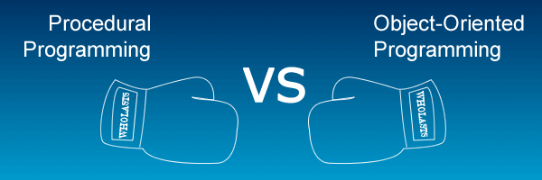

# David Markham 
# Multi-Paradigm-Programming-Project
# G.M.I.T.
# Lecturer: Dominic Carr
# Topic: Create a shop program in Procedural C and Python, and OOP Java/Python.

 

Sometimes Github won't open Jupyter Notebook files. If Github won't open your file, copy and paste the URL address from the Jupyter file on Github and paste in the following link. This will display it every time you wish to view it.

https://nbviewer.jupyter.org/ 

**Table of contents**
- <a href="https://github.com/daithimarkham/Multi-Paradigm-Programming-Project/tree/main/c">C Program</a>
- <a href="https://github.com/daithimarkham/Multi-Paradigm-Programming-Project/tree/main/python">Python Program</a>
- <a href="https://github.com/daithimarkham/Multi-Paradigm-Programming-Project/tree/main/O.O.Prog.Python">Object Orientated Program</a>
- <a href="https://github.com/daithimarkham/Multi-Paradigm-Programming-Project/blob/main/readme.txt">Report</a>

## Getting Started

Build a shop program in C and Python, must be done in a procedural programming style. For part two we will replicate part one, but will be done in Object Orientated manner in Java or Python. 

- **The shop CSV should hold the initial cash value for the shop.**
- **Read in customer orders from a CSV file.**
    - That file should include all the products they wish to buy and in what quantity.
    - It should also include their name and their budget.
- **The shop must be able to process the orders of the customer.**
    - Update the cash in the shop based on money received.
    - It is important that the state of the shop be consistent.
    - You should create customer test files (CSVs) which cannot be completed by the shop e.g. customer wants 400
      loaves of bread but the shop only has 20, or the customer wants 2 cans of coke but can only afford 1.
    - Know whether or not the shop can fill an order. 
- **Operate in a live mode, where the user can enter a product by name, specify a quantity, and pay for it. The user should be able to buy many products in this way.** 

**How to get started and run Jupyter Notebook.** 

- Jupyter Notebook, and how to use one for this project.

For this project we will be using a Jupyter notebook to hold and display all our code. You will also need to download Anaconda, and the terminal which we will be using is going to be Cygwin and Commander.

• Create a new repository on Github, name it, initialize a ReadMe, Add.gitignore-Python, license, and click on clone/download and copy the link.

• Go to your command line, cd desktop, and type: git clone, space and right click. Creates a folder you just created on Github.

• CD into folder, type Jupyter Notebook, which is older but more reliable version, press enter, opens a browser, click on Notebook Python 3.

• Rename file.

• Type in some code in the cell, hold down shift and hit enter to display the code, and save! If you want to use markdown, click on the outer left part of the cell, escape and m, this will change the cell to markdown.

• Shut down browser, go to file, and press close & halt. (When you want to re-use or open up Jupyter again, re-start the kernel and run all cells, previous code might not work otherwise, which you had entered.)

• Go to command line, control plus c and release. Clears Python and and goes back to (master-origin).

• Git status (Tells you all the files updated)

• Git add . (pushes the work you done in the folder you are in up to Github)

• Git commit –m “Name of what you created or done”. (Labels the work you just did on the file.)

• Git push (Pushes all your work you just committed up to Github)

• Repository, ReadMe and Gitignore created. 

**How to get started and run a program in C.**

- Install C-Program Compiler (gcc). We will be using Cygwin for windows. You can find out more <a href="https://cygwin.com/install.html">here</a> how to download it.
- Create your C program.
- Open up compiler we just installed.
- CD into your directory. CD c:, then name of your folder etc.
- Compile your code into an executable file. We will use simple c program 'helloWorld' for example. Run command *gcc helloWorld.c -o hello* to create file.
- Run your program, use the following command: *./helloWorld*. These commands will differ if you are not using Windows. 
- Your program should now have been executed, and printed *helloWorld* to the terminal.

To find out more on how to get started using C language you can find out more <a href="https://www.programiz.com/c-programming">here</a>.

**How to get started and run a program in Python.** 

**How to get started and run an program in Object Orientated Programming.** 

**Summary** 

